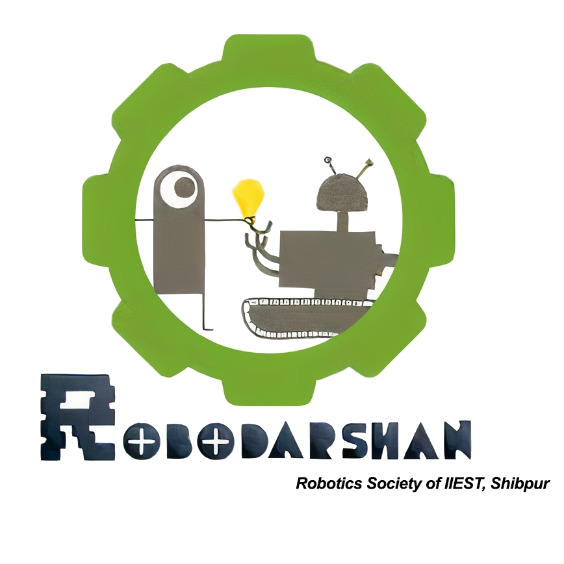
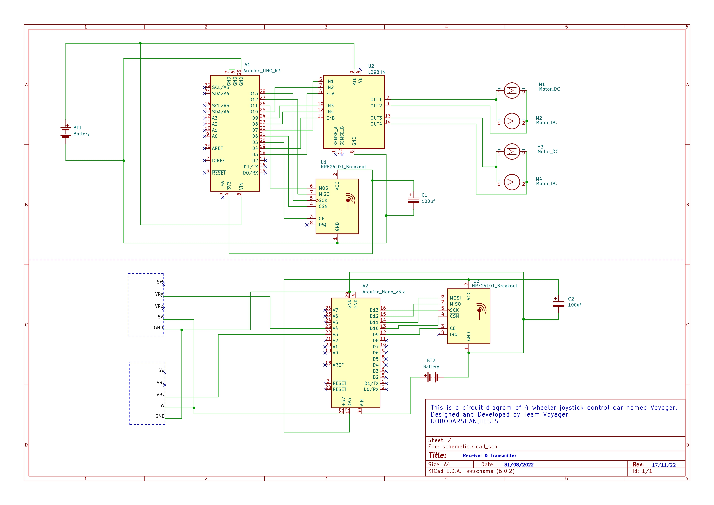
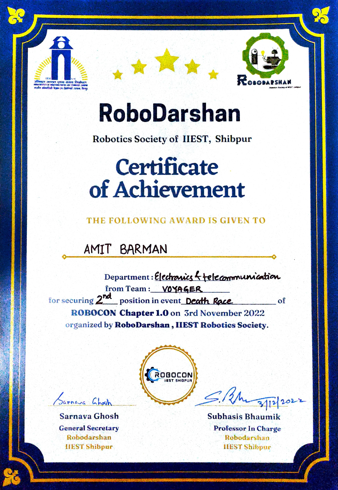
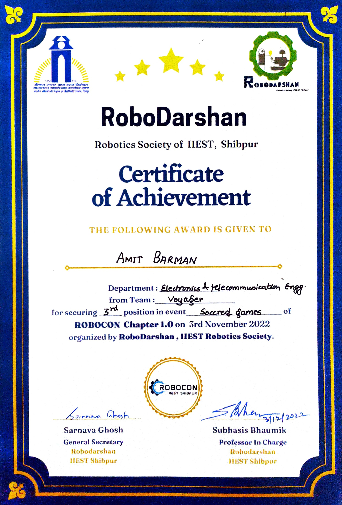
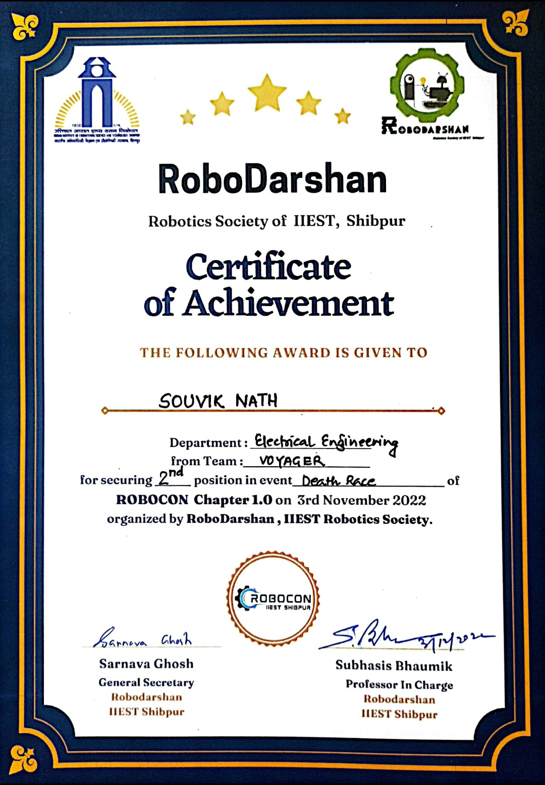
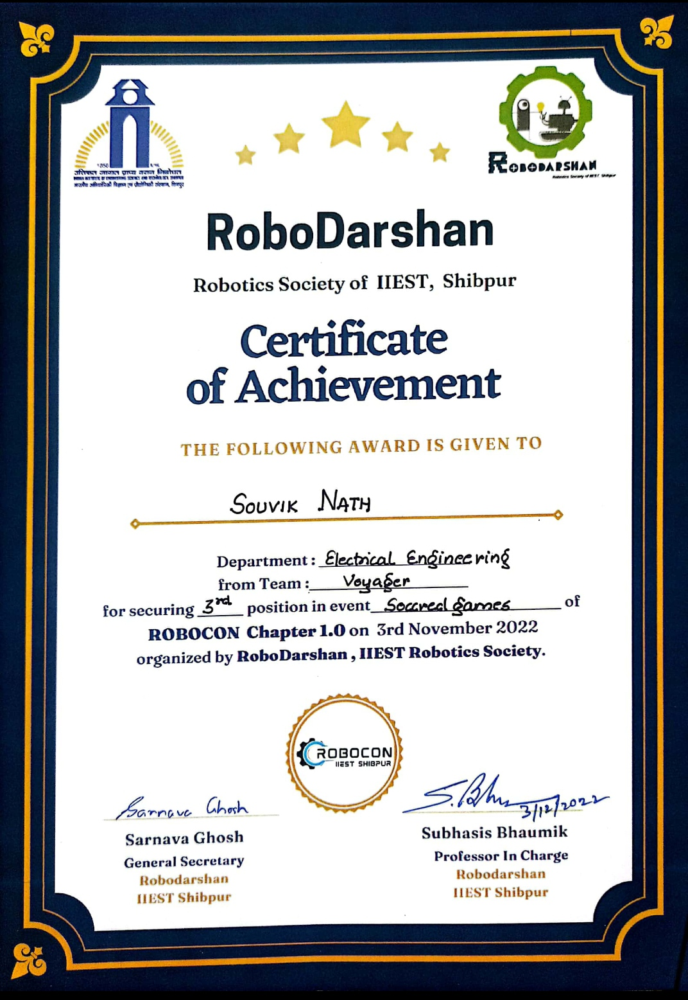

  
  

<h1 align="center">VOYAGER</h1>

IT IS A TEAM OF TWO ENGINEERING STUDENTS CREATED FOR MAKING A
4 WHEELER ROBOT WITH IT'S CUSTOM TRANSMITTER.
THIS TEAM WORKS FOR [ROBODARSHAN](http://student.iiests.ac.in/index.php/robodarshan/) (ROBOTICS SOCIETY OF IIEST SHIBPUR) TO EXPLORE ROBOTICS DOMAIN.

MEMBERS -
 **AMIT BARMAN**, SOPHOMORE AT IIEST SHIBPUR, **ETC'25** 
         **SOUVIK NATH**, SOPHOMORE AT IIEST SHIBPUR, **EE'25** 
         **VINIT RANJAN**, SOPHOMORE AT IIEST SHIBPUR, **CST'25** 
         **MD SUHAIL AZAM**, SOPHOMORE AT IIEST SHIBPUR, **ETC'25**

         
         
 

> 1. AN ARDUINO UNO (FOR RECEIVER)
> 2. AN ARDUINO NANO (FOR TRANSMITTER)
> 3. 2 x NRF24LO1+PA+LNA MODULE
> 4. 2 x JOYSTICKS
> 5. 4 x 200RPM DC MOTORS
> 6. L298N MOTOR DRIVER
> 7. 4 x 3.7V LI-ION BATTERY

 

<!--  -->

**Our progress**
> We completed this project

## Our certificates

|Name|Death race|Soccred games|
|-|-|-|
|Amit Barman|||
|Souvik Nath|||
|Vinit Ranjan|||
|MD Suhail Azam|||

### Don't forget to give a 🌟 to this repository.

### All the best
